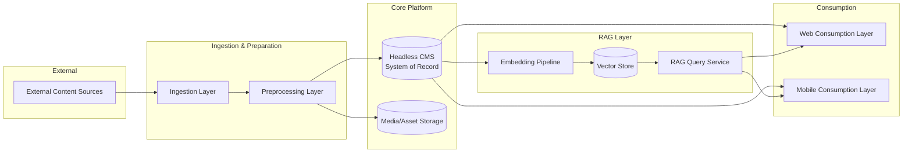

# Architecture Overview

<record_type>architecture_overview</record_type>
<status>living</status>

## 1. Purpose & Scope

This document describes the **stable structure** of the system: the high-level
components, what each one is responsible for, how they interact, and where the
boundaries between them lie. It intentionally avoids justifying *why* a specific
technology was chosen — that reasoning, along with tradeoffs and alternatives, is
recorded separately in [Architecture Decision Records (ADRs)](./adr/README.md).
This document should change rarely; ADRs are expected to accumulate over time.

Where a component's current implementation is relevant, it is named with a
reference to the ADR that explains the choice.

---

## 2. Architectural Principles

These principles hold regardless of which specific technology implements a
component, and should guide future decisions:

1. **The CMS is the single source of truth for content and metadata.** No other
   component stores published content state; everything else either feeds the
   CMS or reads from it.
2. **Ingestion and preprocessing are decoupled from each other and from the CMS.**
   Each stage hands off through a staging boundary so that a failure or slowdown
   in one stage does not corrupt or block another.
3. **Consumption layers (web, mobile) are stateless clients of the CMS/RAG APIs.**
   They never write to the CMS directly and never talk to ingestion or
   preprocessing directly.
4. **The RAG layer is derived, not authoritative.** Embeddings and vector data are
   always rebuildable from CMS content; the vector store is never a system of
   record.
5. **New consumption channels reuse existing APIs.** Mobile (Phase 4) is expected
   to consume the same CMS/RAG APIs as web, not a channel-specific backend.

---

## 3. System Context

---

## 4. Components

### 4.1 Ingestion Layer

- **Responsibility**: Pull content and metadata from external sources and hand
  it off in a normalized, staged form. Guarantee idempotent delivery (re-running
  an ingestion job must not create duplicates).
- **Collaborates with**: receives from External Sources; hands off to the
  Preprocessing Layer via a staging boundary (storage/queue).
- **Boundaries — does NOT**:
  - Perform business-level validation, enrichment, or cleanup (Preprocessing's job).
  - Write directly into the CMS's published content state.
  - Know anything about how content is rendered or consumed downstream.
- **Current implementation**: source-specific adapters on AWS (Lambda/ECS +
  EventBridge/SQS). No ADR yet — implementation detail, not an architectural
  decision point.

### 4.2 Preprocessing & Preparation Layer

- **Responsibility**: Clean, normalize, validate, enrich, and de-duplicate staged
  content; produce CMS-ready entries.
- **Collaborates with**: consumes staged output from Ingestion; writes finalized
  entries to the CMS via its API (never via direct database access).
- **Boundaries — does NOT**:
  - Reach out to external sources directly (depends entirely on Ingestion's output).
  - Render or serve content to end users.
  - Bypass the CMS's own validation/hooks by writing to its database directly.
- **Current implementation**: orchestrated pipeline on AWS. See
  [ADR-0006](./adr/0006-content-preprocessing-orchestration.md).

### 4.3 Headless CMS (System of Record)

- **Responsibility**: Store structured content and metadata, manage the
  publishing lifecycle (draft/published/archived), expose content via API, and
  reference media assets.
- **Collaborates with**: receives writes from Preprocessing; serves reads to Web
  and Mobile consumption layers; serves content to the Embedding Pipeline (RAG
  layer); fires webhooks on publish/update/delete that other components react to.
- **Boundaries — does NOT**:
  - Perform source-specific ingestion logic.
  - Render UI or own presentation concerns.
  - Perform semantic/vector search itself — that is the RAG layer's job, built on
    top of CMS content.
- **Current implementation**: Strapi (self-hosted). See
  [ADR-0001](./adr/0001-use-strapi-as-headless-cms.md). API style: see
  [ADR-0004](./adr/0004-strapi-api-style.md). Admin access control: see
  [ADR-0005](./adr/0005-cms-admin-access-control.md).

### 4.4 Media / Asset Storage

- **Responsibility**: Durable storage for binary assets (images, documents,
  video, etc.) referenced from CMS entries.
- **Collaborates with**: written to by Preprocessing (or CMS upload flows); read
  by Web/Mobile consumption layers (often via a CDN in front of it).
- **Boundaries — does NOT**:
  - Own asset metadata (alt text, captions, relations) — that belongs to the CMS.
- **Current implementation**: S3-backed storage provider for Strapi.

### 4.5 Web Consumption Layer

- **Responsibility**: Render content for end users on the web; query the CMS
  (and later the RAG Query Service) for data; manage caching/revalidation.
- **Collaborates with**: reads from CMS; in Phase 3, also calls the RAG Query
  Service for Q&A features.
- **Boundaries — does NOT**:
  - Own content data — the CMS remains the source of truth even though the web
    layer may cache it.
  - Implement content validation/business logic that belongs in Preprocessing.
- **Current implementation**: Next.js. See
  [ADR-0002](./adr/0002-use-nextjs-for-web-frontend.md). Hosting model: see
  [ADR-0007](./adr/0007-nextjs-hosting-model-on-aws.md).

### 4.6 Embedding Pipeline — *Phase 3*

- **Responsibility**: React to CMS publish/update/unpublish events; generate
  embeddings for (chunked) content; keep the Vector Store in sync with the CMS.
- **Collaborates with**: triggered by CMS webhooks; reads CMS content; writes to
  the Vector Store.
- **Boundaries — does NOT**:
  - Generate or own content — it only derives vectors from what the CMS already
    holds.
  - Serve queries directly (that's the RAG Query Service).
- **Current implementation**: not yet decided. See
  [ADR-0009](./adr/0009-embedding-model-and-llm-provider.md).

### 4.7 Vector Store — *Phase 3*

- **Responsibility**: Store and serve embeddings for similarity search.
- **Collaborates with**: written to by the Embedding Pipeline; read by the RAG
  Query Service.
- **Boundaries — does NOT**:
  - Act as a system of record for content. If lost, it must be fully rebuildable
    by re-running the Embedding Pipeline against the CMS.
- **Current implementation**: not yet decided. See
  [ADR-0008](./adr/0008-vector-database-for-rag.md).

### 4.8 RAG Query Service — *Phase 3*

- **Responsibility**: Accept a natural-language question, retrieve relevant
  chunks from the Vector Store, construct a grounded prompt, call an LLM, and
  return an answer that cites the source CMS entries.
- **Collaborates with**: called by Web/Mobile consumption layers; reads from the
  Vector Store; calls an external/managed LLM.
- **Boundaries — does NOT**:
  - Generate answers without grounding them in retrieved CMS content and citing
    sources.
  - Become a second source of truth for content.
- **Current implementation**: not yet decided. See
  [ADR-0009](./adr/0009-embedding-model-and-llm-provider.md).

### 4.9 Mobile Consumption Layer — *Phase 4*

- **Responsibility**: Render content and Q&A features for end users on mobile,
  using the same data as the web layer.
- **Collaborates with**: reads from CMS and (Phase 3+) the RAG Query Service —
  identical integration points to the Web Consumption Layer.
- **Boundaries — does NOT**:
  - Introduce a mobile-specific backend or duplicate business logic that already
    lives behind the CMS/RAG APIs.
- **Current implementation**: not yet decided. See
  [ADR-0010](./adr/0010-mobile-app-framework.md).

---

## 5. Component Boundary Map

| Component | Depends On | Depended On By | Must Not Do |
|---|---|---|---|
| Ingestion Layer | External Sources | Preprocessing Layer | Validate/enrich content; write to CMS directly |
| Preprocessing Layer | Ingestion Layer (staged output) | CMS | Call external sources directly; bypass CMS API |
| Headless CMS | Preprocessing Layer (writes) | Web, Mobile, Embedding Pipeline | Render UI; perform vector search |
| Media Storage | Preprocessing Layer / CMS (writes) | Web, Mobile (via CDN) | Own asset metadata |
| Web Consumption Layer | CMS, RAG Query Service (Phase 3) | End users | Own content data; implement content validation |
| Embedding Pipeline | CMS (webhooks + reads) | Vector Store | Generate/own content; serve queries |
| Vector Store | Embedding Pipeline (writes) | RAG Query Service | Act as a system of record |
| RAG Query Service | Vector Store, LLM provider | Web, Mobile | Answer ungrounded/uncited questions |
| Mobile Consumption Layer | CMS, RAG Query Service (Phase 3) | End users | Introduce a separate backend |

---

## 6. Data Flow Narrative

1. **Ingestion** pulls raw content/metadata from external sources and stages it,
   tagged with a stable external ID for idempotency.
2. **Preprocessing** picks up staged content, cleans/validates/enriches it, and
   writes finished entries to the **CMS** via its API.
3. The **CMS** becomes the system of record; it serves the **Web** (and later
   **Mobile**) consumption layers directly via API, and stores media references
   pointing at **Media Storage**.
4. *(Phase 3)* On every publish/update/unpublish, the CMS fires a webhook that
   triggers the **Embedding Pipeline**, which (re)computes embeddings and syncs
   the **Vector Store**.
5. *(Phase 3)* The **RAG Query Service** retrieves from the Vector Store at query
   time, grounds an LLM response in that retrieved content, and returns an
   answer with citations back to the CMS entries used.
6. *(Phase 4)* **Mobile** integrates at the same two points as Web: the CMS API
   and the RAG Query Service — no new backend surface is introduced.

---

## 7. Phased Evolution

| Phase | Components Active |
|---|---|
| **Phase 1** | Ingestion, Preprocessing, Headless CMS, Media Storage |
| **Phase 2** | + Web Consumption Layer (production-hardened) |
| **Phase 3** | + Embedding Pipeline, Vector Store, RAG Query Service |
| **Phase 4** | + Mobile Consumption Layer |

The component boundaries defined in Section 4 are designed to hold across all
four phases — later phases add components, they should not require redrawing
the boundaries of earlier ones.

---

## 8. Cross-Cutting Concerns (Principles, Not Implementations)

- **Authentication/Authorization**: each consumption layer authenticates its own
  end users (if/when content is gated); the CMS authenticates editors
  separately. Specific mechanisms are an ADR-level decision, not an
  architectural boundary.
- **Webhooks as the integration backbone**: any component that needs to react to
  content changes (cache invalidation, re-embedding) does so via CMS webhooks,
  not by polling or reaching into the CMS database.
- **Environment isolation**: dev/staging/production each get fully isolated
  infrastructure (no shared CMS database across environments).
- **Observability**: every component that processes data asynchronously
  (Ingestion, Preprocessing, Embedding Pipeline) must emit structured logs and
  failure alerts, since these stages are the easiest places for silent data loss.

---

## 9. Related ADRs

See [adr/README.md](./adr/README.md) for the full, evolving list of
Architecture Decision Records — including already-decided choices (CMS,
frontend, hosting platform) and currently open decisions with recommended
defaults.

---

## 10. Glossary

- **System of Record**: the component whose state is authoritative; all other
  components either feed it or derive from it.
- **Staging boundary**: a durable handoff point (queue/storage) between two
  components that decouples their failure modes.
- **RAG (Retrieval-Augmented Generation)**: answering questions by retrieving
  relevant content and grounding an LLM's response in it.
- **ADR (Architecture Decision Record)**: a short document capturing a specific
  decision, its context, and its consequences.
  
## Update Rules

<update_rules>
Update this file when a module, boundary, runtime dependency, deployment shape, or data ownership rule changes.
</update_rules>
