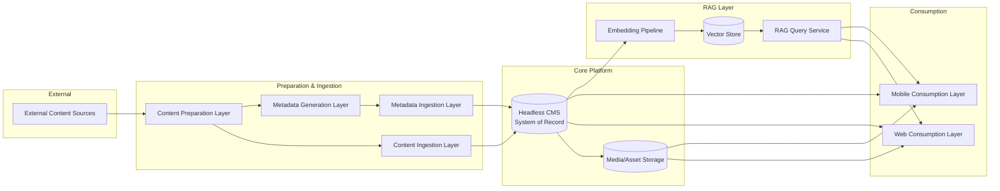

# Architecture Overview

<record_type>architecture_overview</record_type>
<status>living</status>

## 1. Purpose & Scope

This document describes the **stable structure** of the system: the high-level
components, what each one is responsible for, how they interact, and where the
boundaries between them lie. It intentionally avoids justifying *why* a specific
technology was chosen — that reasoning, along with tradeoffs and alternatives, is
recorded separately in [Architecture Decision Records (ADRs)](./adr/README.md).
This document should change rarely; ADRs are expected to accumulate over time.

Where a component's current implementation is relevant, it is named with a
reference to the ADR that explains the choice.

---

## 2. Architectural Principles

These principles hold regardless of which specific technology implements a
component, and should guide future decisions:

1. **The CMS is the single source of truth for content and metadata.** No other
   component stores published content state; everything else either feeds the
   CMS or reads from it.
2. **Preparation and ingestion are decoupled from each other and from the CMS.**
   Each stage hands off through a staging boundary so that a failure or slowdown
   in one stage does not corrupt or block another.
3. **Consumption layers (web, mobile) are stateless clients of the CMS/RAG APIs.**
   They never write to the CMS directly and never talk to preparation or
   ingestion directly.
4. **The RAG layer is derived, not authoritative.** Embeddings and vector data are
   always rebuildable from CMS content; the vector store is never a system of
   record.
5. **New consumption channels reuse existing APIs.** Mobile (Phase 4) is expected
   to consume the same CMS/RAG APIs as web, not a channel-specific backend.

---

## 3. System Context

---

## 4. Components

### 4.1 Content Preparation Layer

- **Responsibility**: Prepare legacy source content before CMS ingestion. This
  includes Unicode conversion, chapter splitting, Assignment of Subject code and Subject Category code, basic metadata generation, and other transformations needed to produce CMS-ingestion-ready artifacts.
- **Collaborates with**: consumes source in MS Word 2007 format obtained from external sources, manually obtains Subject code and Category code fom CMS system's seed data for the job configuration; produces artifacts for the future Content Ingestion Layer.
- **Boundaries — does NOT**:
  - Write finalized entries directly into the CMS.
  - Render or serve content to end users.
  - Own the published content lifecycle.
- **Current implementation**: Python utility under
  `tools/content-preparation/`, currently used for legacy DOCX Unicode
  conversion, Unicode DOCX ingest, chapter splitting, and preparation artifact
  publication to local storage or Cloudflare R2. See
  [ADR-0013](./adr/0013-use-cloudflare-r2-for-prepared-content-artifacts.md).
- **Planned/recommended direction**: Shri-Lipi font conversion was unsuccessful. As such newly created documents cannot be used by our system. We need to find a solution to this problem.

### 4.2 Content Ingestion Layer

- **Responsibility**: Import prepared content and basic metadata artifacts into the
  CMS. Guarantee idempotent delivery so re-running an ingestion job does not
  create duplicate CMS entries.
- **Collaborates with**: consumes artifacts produced by the Content Preparation
  Layer; writes finalized entries to the CMS via its API (never via direct
  database access).
- **Boundaries — does NOT**:
  - Reach out to external source material directly.
  - Perform DOCX Unicode conversion, chapter splitting, or artifact generation.
  - Bypass the CMS's own validation/hooks by writing to its database directly.
  - Know anything about how content is rendered or consumed downstream.
- **Current implementation**: not implemented yet. `tools/content-ingestion/`
  is a placeholder for future CMS ingestion tooling.
- **Planned/recommended direction**: AWS-based ingestion workers or adapters may
  be introduced later, but no ingestion ADR has been accepted yet.

### 4.3 Metadata Generation Layer

- **Responsibility**: Generates content specific metadata such as 'tags' or 'content descriptors' for Subject content already split into chapters. The objective is to keep refining and updating 'tags' as well as 'content-descriptors' so that search function and the AI chatbot to be introduced later will be able to find relevant information quickly and correctly.
- **Collaborates with**: Consumes artifacts produced by the Content Preparation
  Layer
- **Boundaries — does NOT**:
  - Does not generate metadata for a subject stored entirely in a single file.
  - Reach out to external source material directly.
  - Perform DOCX Unicode conversion, chapter splitting, or artifact generation.
  - Does NOT update generated metadata for content already present in the CMS via its API
  - Bypass the CMS's own validation/hooks by writing to its database directly.
  - Know anything about how content is rendered or consumed downstream.
- **Current implementation**: not implemented yet. `tools/metadata-generation/` is a placeholder for future metadata generation tooling.
- **Planned/recommended direction**: No metadata generation ADR has been accepted yet.

### 4.4 Metadata Ingestion Layer

- **Responsibility**: Updates prepared content-specific metadata such as 'tags' or 'content descriptors' for content already split into chapters into the CMS.  
- **Collaborates with**: Consumes artifacts produced by the Metadata Generation Layer
- **Boundaries — does NOT**:
  - Does not generate metadata
  - Does not create content entry into CMS. This is an update operation and therefore it should fail if the content is not already found in the CMS
  - Reach out to external source material directly.
  - Perform DOCX Unicode conversion, chapter splitting, or artifact generation.
  - Bypass the CMS API when updating generated metadata for content already present in the CMS.
  - Bypass the CMS's own validation/hooks by writing to its database directly.
  - Know anything about how content is rendered or consumed downstream.
- **Current implementation**: not implemented yet. `tools/metadata-ingestion/` is a placeholder for future metadata ingestion tooling.
- **Planned/recommended direction**: No metadata ingestion ADR has been accepted yet.

### 4.5 Headless CMS (System of Record)

- **Responsibility**: Store structured content and metadata, manage the
  publishing lifecycle (draft/published/archived), expose content via API, and
  reference media assets.
- **Collaborates with**: receives writes from Content Ingestion, Metadata Ingestion; serves reads to Web and Mobile consumption layers; serves content to the Embedding Pipeline
  (RAG layer); fires webhooks on publish/update/delete that other components
  react to.
- **Boundaries — does NOT**:
  - Perform source-specific ingestion logic.
  - Render UI or own presentation concerns.
  - Perform semantic/vector search itself — that is the RAG layer's job, built on
    top of CMS content.
- **Current implementation**: Strapi (self-hosted). See
  [ADR-0001](./adr/0001-use-strapi-as-headless-cms.md). API style: see
  [ADR-0004](./adr/0004-strapi-api-style.md). Admin access control: see
  [ADR-0005](./adr/0005-cms-admin-access-control.md).

### 4.6 Media / Asset Storage

- **Responsibility**: Durable, Cloud-based storage for binary assets (documents,
  audio, etc.) referenced from CMS entries.
- **Collaborates with**: Likely to be the CMS - the content management system as most such systems provide plugins to collaborate with cloud storages; may be read by Web/Mobile consumption layers, in the initial phases (often via a CDN in front of it).
- **Boundaries — does NOT**:
  - Own asset metadata (alt text, captions, relations) — that belongs to the CMS.
- **Current implementation**: None
- **Planned/recommended direction**: S3-backed storage provider for Strapi.

### 4.7 Web Consumption Layer

- **Responsibility**: Render content for end users on the web; query the CMS
  (and later the RAG Query Service) for data; manage caching/revalidation.
- **Collaborates with**: reads from CMS; in Phase 3, also calls the RAG Query
  Service for Q&A features.
- **Boundaries — does NOT**:
  - Own content data — the CMS remains the source of truth even though the web
    layer may cache it.
  - Implement content validation/business logic that belongs in Content
    Preparation or Content Ingestion.
- **Current implementation**: Next.js. See
  [ADR-0002](./adr/0002-use-nextjs-for-web-frontend.md). Hosting model: see
  [ADR-0007](./adr/0007-nextjs-hosting-model-on-aws.md).

### 4.8 Embedding Pipeline — *Phase 3*

- **Responsibility**: React to CMS publish/update/unpublish events; generate
  embeddings for (chunked) content; keep the Vector Store in sync with the CMS.
- **Collaborates with**: triggered by CMS webhooks; reads CMS content; writes to
  the Vector Store. 
- **Boundaries — does NOT**:
  - Generate or own content — it only derives vectors from what the CMS already
    holds.
  - Serve queries directly (that's the RAG Query Service).
- **Current implementation**: not yet decided; we need to work on how the generated embeddings work with "content descriptors metadata" prepared by metadata-generation tool to make search effective and efficient. See
  [ADR-0009](./adr/0009-embedding-model-and-llm-provider.md).

### 4.9 Vector Store — *Phase 3*

- **Responsibility**: Store and serve embeddings for similarity search.
- **Collaborates with**: written to by the Embedding Pipeline; read by the RAG
  Query Service.
- **Boundaries — does NOT**:
  - Act as a system of record for content. If lost, it must be fully rebuildable
    by re-running the Embedding Pipeline against the CMS.
- **Current implementation**: likely to be pgvector extension for PostgreSQL See
  [ADR-0008](./adr/0008-vector-database-for-rag.md).

### 4.10 RAG Query Service — *Phase 3*

- **Responsibility**: Accept a natural-language question, retrieve relevant
  chunks from the Vector Store, construct a grounded prompt, call an LLM, and
  return an answer that cites the source CMS entries.
- **Collaborates with**: called by Web/Mobile consumption layers; reads from the
  Vector Store; calls an external/managed LLM.
- **Boundaries — does NOT**:
  - Generate answers without grounding them in retrieved CMS content and citing
    sources.
  - Become a second source of truth for content.
- **Current implementation**: not yet decided. See
  [ADR-0009](./adr/0009-embedding-model-and-llm-provider.md).

### 4.11 Mobile Consumption Layer — *Phase 4*

- **Responsibility**: Render content and Q&A features for end users on mobile,
  using the same data as the web layer.
- **Collaborates with**: reads from CMS and (Phase 3+) the RAG Query Service —
  identical integration points to the Web Consumption Layer.
- **Boundaries — does NOT**:
  - Introduce a mobile-specific backend or duplicate business logic that already
    lives behind the CMS/RAG APIs.
- **Current implementation**: not yet decided. See
  [ADR-0010](./adr/0010-mobile-app-framework.md).

---

## 5. Component Boundary Map

| Component | Depends On | Depended On By | Must Not Do |
|---|---|---|---|
| Content Preparation Layer | Source DOCX files, job configuration, CMS seed-code references | Content Ingestion Layer, Metadata Generation Layer | Write finalized entries directly to CMS |
| Content Ingestion Layer | Prepared content artifacts | CMS | Convert DOCX; split chapters; bypass CMS API |
| Metadata Generation Layer | Prepared chapter-level artifacts | Metadata Ingestion Layer, future search/RAG workflows | Generate metadata for unsplit single-file subjects; update CMS directly; convert DOCX |
| Metadata Ingestion Layer | Generated metadata artifacts, existing CMS entries | CMS | Generate metadata; create new CMS content entries; bypass CMS API |
| Headless CMS | Content Ingestion Layer and Metadata Ingestion Layer writes | Web, Mobile, Embedding Pipeline | Render UI; perform vector search |
| Media Storage | CMS / storage-provider integration | Web, Mobile (via CDN) | Own asset metadata |
| Web Consumption Layer | CMS, RAG Query Service (Phase 3) | End users | Own content data; implement content validation |
| Embedding Pipeline | CMS (webhooks + reads) | Vector Store | Generate/own content; serve queries |
| Vector Store | Embedding Pipeline (writes) | RAG Query Service | Act as a system of record |
| RAG Query Service | Vector Store, LLM provider | Web, Mobile | Answer ungrounded/uncited questions |
| Mobile Consumption Layer | CMS, RAG Query Service (Phase 3) | End users | Introduce a separate backend |

---

## 7. Phased Evolution

| Phase | Components Active |
|---|---|
| **Current implemented foundation** | Local Content Preparation utility, Headless CMS scaffold, local PostgreSQL scripts |
| **Phase 1 target** | Content Ingestion, Content Preparation, Headless CMS, Media Storage |
| **Phase 2** | + Web Consumption Layer (production-hardened) |
| **Phase 3** | + Embedding Pipeline, Vector Store, RAG Query Service |
| **Phase 4** | + Mobile Consumption Layer |

The component boundaries defined in Section 4 are designed to hold across all
four phases — later phases add components, they should not require redrawing
the boundaries of earlier ones.

---

## 8. Cross-Cutting Concerns (Principles, Not Implementations)

- **Authentication/Authorization**: each consumption layer authenticates its own
  end users (if/when content is gated); the CMS authenticates editors
  separately. Specific mechanisms are an ADR-level decision, not an
  architectural boundary.
- **Webhooks as the integration backbone**: any component that needs to react to
  content changes (cache invalidation, re-embedding) does so via CMS webhooks,
  not by polling or reaching into the CMS database.
- **Environment isolation**: dev/staging/production each get fully isolated
  infrastructure (no shared CMS database across environments).
- **Observability**: every component that processes data asynchronously
  (Content Ingestion, Content Preparation, Embedding Pipeline) must emit
  structured logs and failure alerts, since these stages are the easiest places
  for silent data loss.

---

## 9. Related ADRs

See [adr/README.md](./adr/README.md) for the full, evolving list of
Architecture Decision Records — including already-decided choices (CMS,
frontend, hosting platform) and currently open decisions with recommended
defaults.

---

## 10. Glossary

- **System of Record**: the component whose state is authoritative; all other
  components either feed it or derive from it.
- **Staging boundary**: a durable handoff point (queue/storage) between two
  components that decouples their failure modes.
- **RAG (Retrieval-Augmented Generation)**: answering questions by retrieving
  relevant content and grounding an LLM's response in it.
- **ADR (Architecture Decision Record)**: a short document capturing a specific
  decision, its context, and its consequences.
  
## Update Rules

<update_rules>
Update this file when a module, boundary, runtime dependency, deployment shape, or data ownership rule changes.
</update_rules>
