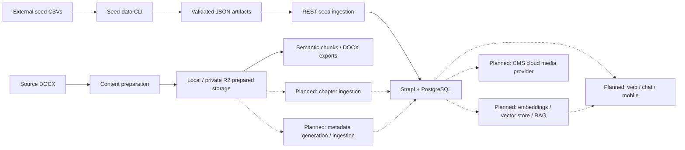

# Architecture Overview

<record_type>architecture_overview</record_type>
<status>living</status>

## Scope and ownership

This map describes checked-in components and intended connections.
Implemented means supported by repository code; it does not establish deployment.
Accepted choices may still be unimplemented. Undecided choices are listed in the
[ADR index](adr/README.md#open-choices).

| Information | Maintained owner |
| --- | --- |
| Components, connections, data ownership, implementation status, code entry points | This overview |
| Rationale, material tradeoffs, reconsideration triggers | [ADRs](adr/README.md) and [decisions](decisions/README.md) |
| Cross-component semantics and consumer obligations | [Interface contracts](interfaces/README.md) |
| Structural fields, algorithms, constants, detailed runtime behavior | Linked schemas and code |
| Setup, commands, recovery | Component guides linked below |
| Execution, authorization, delivery, superseded history | Relevant GitHub issues and Git history |

The CMS owns published CMS content and metadata. Prepared storage owns canonical
prepared text before ingestion. Preparation and ingestion are separate stages;
preparation produces artifacts and does not write finalized CMS entries.
Seed ingestion writes through the Strapi API, never directly to PostgreSQL.

Future reading, chat, and mobile clients consume CMS/RAG APIs. Retrieval data
will be derived from CMS content and rebuildable; it must not become another
content authority. These connections are intent, not implemented APIs.

## System context

Solid arrows are implemented handoffs; dotted arrows are planned connections.

```mermaid
flowchart LR
    CSV["External seed CSVs"] --> SEED["Seed-data CLI"]
    SEED --> JSON["Validated JSON artifacts"]
    JSON --> API["REST seed ingestion"]
    API --> CMS["Strapi + PostgreSQL"]
    DOCX["Source DOCX"] --> PREP["Content preparation"]
    PREP --> STORE["Local / private R2 prepared storage"]
    STORE --> DERIVED["Semantic chunks / DOCX exports"]
    STORE -.-> ING["Planned: chapter ingestion"]
    ING -.-> CMS
    STORE -.-> META["Planned: metadata generation / ingestion"]
    META -.-> CMS
    CMS -.-> CLIENT["Planned: web / chat / mobile"]
    CMS -.-> RAG["Planned: embeddings / vector store / RAG"]
    RAG -.-> CLIENT
    CMS -.-> MEDIA["Planned: CMS cloud media provider"]
```

[Seed artifacts](interfaces/seed-data-artifacts.md) reach the CMS today.
[Prepared artifacts](interfaces/prepared-content-artifacts.md) do not: chapter
and metadata ingestion remain unimplemented. Prepared semantic chunks are files,
not a retrieval service. R2 prepared storage is separate from PostgreSQL and
the planned CMS media provider.

## Domain and identity

A **Category** groups **Subjects**; each Subject references one Category.
Preparation splits a subject DOCX at editorial headings into **Chapters**.
**Prabodhan** names the numbered divisions in derived DOCX titles, and Subject
has an optional `prabodhan_count`. This does not imply one-to-one identity
between audio lectures, chapters, and source files. A **Chunk** is a generated
semantic segment of prepared chapter text. Chapter and Chunk CMS collections
are unimplemented.

Hindi (`hi-IN`) and Marathi (`mr-IN`) prepared editions have independent release
roots, provenance, checkpoints, and derived outputs. This differs from the
English (`en`) and Hindi Category/Subject display localizations in seed ingestion.

Sanatan Glossary and Prabodhan Glossary are independent, non-localized term
collections. Neither has chapter relations or automatic tagging. Their editorial
assignment distinction remains open under
[#353](https://github.com/Team-Gurubodh/gurubodh/issues/353).

| Identifier | Scope and behavior |
| --- | --- |
| Category / Subject business `code` | `CATnnn` / `SUBnnn`, unique per collection and shared across localizations. Display-text edits retain the code; Subjects reference Category by code. |
| Glossary `term_code` → CMS `code` | Stable within one glossary. Term/definition edits retain it; another glossary may use the same code. |
| Prepared `content_key` | Normalized content state within Category, Subject, and language. Normalized text changes change it; chapter reordering does not. It is not permanent editorial chapter identity. |
| Strapi `documentId` | CMS-generated document identity for API updates, localizations, and relations. Updates retain it; recreation in another CMS need not. External artifacts omit it. |

The [seed contract](interfaces/seed-data-artifacts.md#identity-and-locales) owns
CMS mapping semantics. The [prepared contract](interfaces/prepared-content-artifacts.md#content-identity-and-manifest)
owns content-state semantics; [content_identity.py](../tools/gurubodh-cli/gurubodh/content_identity.py)
defines normalization and key construction. The
[chapter registry task](tasks/002-CMS-led-chapter-identity-registry.md) is an
exploratory proposal, not implemented identity behavior.

## Components

| Component | Responsibility | Implementation status | Code entry point / guide |
| --- | --- | --- | --- |
| Strapi CMS | Published CMS content/metadata; Draft & Publish; API access | Implemented: Category, Subject, both glossaries | [Collection schemas](../apps/gurubodh-cms/src/api/); [CMS guide](../apps/gurubodh-cms/README.md) |
| PostgreSQL infrastructure | Provision and maintain the CMS database | Implemented local scripts; cloud deployment not established here | [DB scripts and guide](../database/postgres/gurubodh-cms/README.md) |
| Seed-data CLI | Validate CSV, generate reviewable artifacts, reconcile CMS records over REST | Implemented for Category, Subject, both glossaries | [Package](../tools/seed-data-cli/gurubodh_seed_data/); [guide](../tools/seed-data-cli/README.md) |
| Content preparation | Supported DOCX conversion/extraction, chapter splitting, mandatory canonical proofreading | Implemented native Python and CPU container; lab proofreading is non-canonical | [CLI](../tools/gurubodh-cli/gurubodh/); [guide](../tools/gurubodh-cli/README.md) |
| Prepared storage | Canonical text/metadata, provenance, manifests, operational state | Implemented local filesystem and private R2 | [Prep publication](../tools/gurubodh-cli/gurubodh/prep_publication.py); [contract](interfaces/prepared-content-artifacts.md) |
| Derived outputs | Rebuildable semantic chunks and human-readable chapter DOCX | Implemented; no persisted retrieval vectors | [Shared lifecycle](../tools/gurubodh-cli/gurubodh/derived_artifact_lifecycle.py); [DOCX export](../tools/gurubodh-cli/gurubodh/docx/export.py) |
| Chapter ingestion | Deliver prepared chapters through the CMS API | Planned; no implementation | Future CLI extension |
| Metadata generation / ingestion | Derive chapter descriptors, then update existing CMS entries | Planned; no implementation | Future CLI extension |
| CMS cloud media provider | Store CMS-referenced binary assets | Planned; provider not selected | No code entry point |
| Web | Render CMS content | Next.js accepted; application unscaffolded | [Placeholder](../apps/gurubodh-web/README.md); [ADR-0002](adr/0002-use-nextjs-for-web-frontend.md) |
| Chat | Present grounded answers and source context | Planned; application unscaffolded | [Placeholder](../apps/gurubodh-chat/README.md) |
| Embeddings / vector store / RAG | Derived retrieval and grounded answer generation | Planned; provider/model/store undecided | [Exploratory task](tasks/001-RAG-architecture.md); [open choices](adr/README.md#open-choices) |
| Mobile | Consume CMS/RAG APIs | Planned; framework undecided | No code entry point |

## Accepted direction and unresolved work

[Strapi](adr/0001-use-strapi-as-headless-cms.md),
[Next.js](adr/0002-use-nextjs-for-web-frontend.md), and
[AWS hosting direction](adr/0003-use-aws-as-hosting-platform.md) are accepted.
[Cloudflare R2](adr/0006-use-cloudflare-r2-for-prepared-content-artifacts.md)
qualifies the AWS direction for prepared storage. These choices do not prove
cloud deployment or select an AWS runtime.

Future ingestion, metadata, retrieval, and mobile work must establish their
contracts in their owning issues. The [goals](goals.md) own roadmap priorities;
[limitations](limitations.md) own known constraints. Agents should follow
[AGENTS.md](../AGENTS.md) and read only references needed for the active question.

## Update rules

<update_rules>
Update this overview when components, connections, ownership, or implementation status change. Keep procedures and structural details with their maintained owners.
</update_rules>
