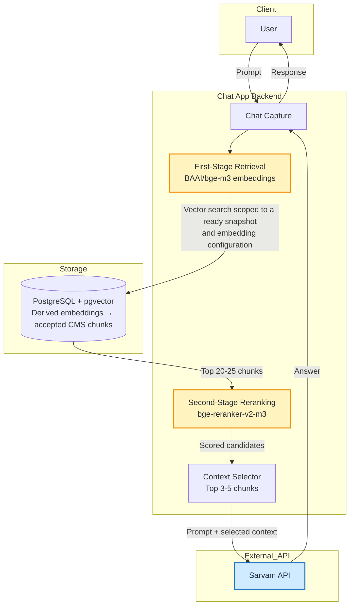

# Task-001: RAG Architecture

<record_type>task_history</record_type>
<status>proposed</status>
<date>2026-07-19</date>
<owners>Team Gurubodh</owners>

## Goal

Document the proposed chat application retrieval workflow without promoting it
to stable architecture before the chat application exists in the repository.

## Context

The proposed workflow uses a two-stage retrieval pipeline to keep chat context
high-signal before it is sent to the answer-generation API:

1. The user sends a prompt to the chat application.
2. The app embeds the prompt with `BAAI/bge-m3`.
3. The app queries PostgreSQL with `pgvector` for the top 20-25 candidate
   chunks.
4. The app reranks those candidates with `bge-reranker-v2-m3`.
5. The app selects the top 3-5 highest-scoring chunks.
6. The app sends the user prompt and selected chunks to the Sarvam API.
7. The generated response is returned to the user.

This note is intentionally scoped as proposed/exploratory. The current
architecture overview already includes a Phase 3 RAG layer, and related
decisions remain proposed in
[ADR-0008](../adr/0008-vector-database-for-rag.md) and
[ADR-0009](../adr/0009-embedding-model-and-llm-provider.md).

## Decisions

- Record the chat workflow as a task/design note under `docs/tasks/`.
- Do not update `docs/architecture.md` until the chat application and RAG query
  workflow become accepted architecture.
- Keep model and provider choices visible in the diagram because they are the
  most important proposed integration points.

## Proposed RAG Data Lifecycle and Retrieval Boundaries

The chapter identity, revision, accepted-chunk, and finalized-snapshot
model is described in
[Task 002](002-CMS-led-chapter-identity-registry.md).
The RAG pipeline derives embeddings from accepted chunks belonging to an
immutable finalized CMS snapshot. Vector data remains derived and rebuildable.

Chunks and embeddings have separate identities and lifecycles. A change
to source text or chunking configuration requires a matching chunk set
and embeddings. A change only to embedding configuration requires new
embeddings for the existing accepted chunks. These identities remain
separate even when only one active embedding exists per chunk; CMS-owned
chunk text is separate from derived vector storage.

An `embedding_config_key` identifies the provider, model and version,
embedding mode, vector dimensions, normalization, and relevant
schema/strategy details. Query embeddings must be compatible with the
configuration selected for retrieval. The detailed implementation plan
must define this configuration contract.

For each subject/locale in scope, retrieval resolves a fully ready
snapshot for the selected embedding configuration. Snapshot membership
and embedding-configuration restrictions apply when selecting the top
20–25 candidates. Retrieve candidate chunk text and exact revision
provenance for reranking, then pass the selected top 3–5 chunks to answer
generation.

CMS publication and RAG readiness advance independently. A newer current
CMS snapshot may have pending or failed embeddings while chat continues
using an older fully ready snapshot. Lag reporting and fallback behavior
remain decisions for the implementation plan.

Embedding jobs record source snapshot and revision identifiers, chunk-set
and embedding configurations, source checksums, actor/source provenance,
status, timestamps, errors, and retry information. Retries should reuse
valid completed derivations rather than duplicate work.

The earlier exploration assumed approximately 10,000–15,000 chapters.
Validate retrieval latency, chunk volume, indexing, and candidate
hydration against representative data before accepting this as a
production design.

Earlier chapter-versioning exploration in [Issue #176](https://github.com/Team-Gurubodh/gurubodh/issues/176) considered rejecting imports that match an older revision and operator-led revision restoration; these remain historical proposals, not adopted requirements of this RAG design.

## Proposed Architecture Diagram

## Approved Plan

- Add this proposed task/design note.
- Link the note to the existing RAG-related ADRs.
- Leave stable architecture documentation unchanged.

## Execution Results

- Added the proposed chat RAG workflow note and highlighted architecture-style
  Mermaid diagram.
- Kept the workflow out of stable architecture documentation until the design is
  accepted.

## Follow-Up

- Decide whether this proposed workflow should become an ADR if it becomes the
  accepted chat RAG design.
- Revisit [ADR-0009](../adr/0009-embedding-model-and-llm-provider.md) if Sarvam
  API and the BGE models become production provider choices instead of
  exploratory design inputs.
