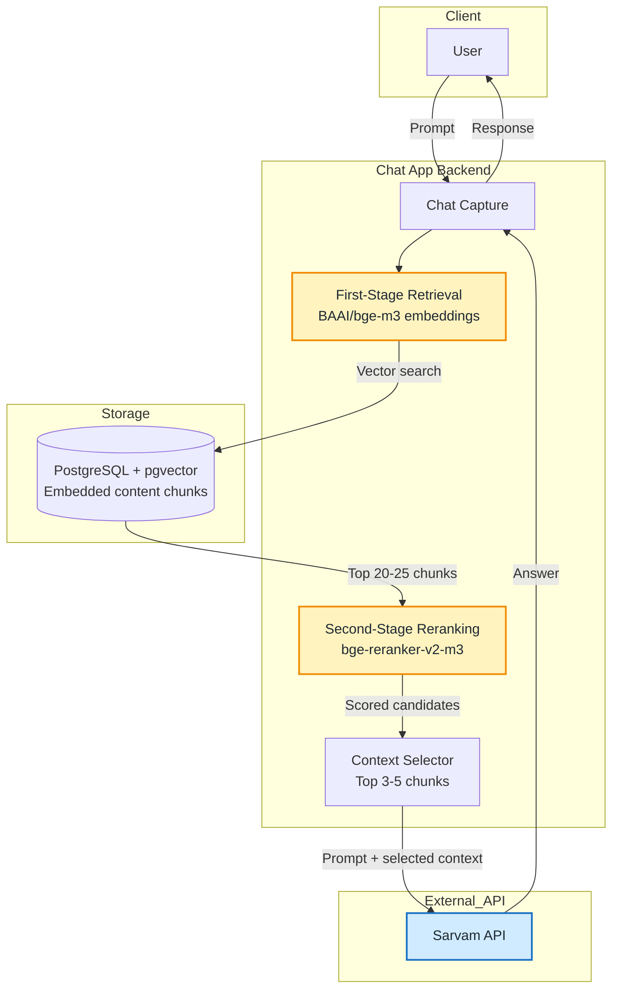

# Task-015: Chat RAG Workflow

<record_type>task_history</record_type>
<status>proposed</status>
<date>2026-07-19</date>
<owners>Team Gurubodh</owners>

## Goal

Document the proposed chat application retrieval workflow without promoting it
to stable architecture before the chat application exists in the repository.

## Context

The proposed workflow uses a two-stage retrieval pipeline to keep chat context
high-signal before it is sent to the answer-generation API:

1. The user sends a prompt to the chat application.
2. The app embeds the prompt with `BAAI/bge-m3`.
3. The app queries PostgreSQL with `pgvector` for the top 20-25 candidate
   chunks.
4. The app reranks those candidates with `bge-reranker-v2-m3`.
5. The app selects the top 3-5 highest-scoring chunks.
6. The app sends the user prompt and selected chunks to the Sarvam API.
7. The generated response is returned to the user.

This note is intentionally scoped as proposed/exploratory. The current
architecture overview already includes a Phase 3 RAG layer, and related
decisions remain proposed in
[ADR-0008](../adr/0008-vector-database-for-rag.md) and
[ADR-0009](../adr/0009-embedding-model-and-llm-provider.md).

## Decisions

- Record the chat workflow as a task/design note under `docs/tasks/`.
- Do not update `docs/architecture.md` until the chat application and RAG query
  workflow become accepted architecture.
- Keep model and provider choices visible in the diagram because they are the
  most important proposed integration points.

## Proposed Architecture Diagram

## Approved Plan

- Add this proposed task/design note.
- Link the note to the existing RAG-related ADRs.
- Leave stable architecture documentation unchanged.

## Execution Results

- Added the proposed chat RAG workflow note and highlighted architecture-style
  Mermaid diagram.
- Kept the workflow out of stable architecture documentation until the design is
  accepted.

## Follow-Up

- Decide whether this proposed workflow should become an ADR if it becomes the
  accepted chat RAG design.
- Revisit [ADR-0009](../adr/0009-embedding-model-and-llm-provider.md) if Sarvam
  API and the BGE models become production provider choices instead of
  exploratory design inputs.
